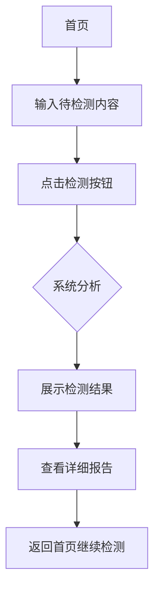

## 1. Product Overview
资料真假性及准确性核验APP，帮助用户快速辨别网络信息的真实性和来源可靠性。

- **主要目的**：解决用户在查询资料时难以辨别信息真假的问题，提高信息获取效率
- **目标用户**：学生人士、工作人士及其他需要查阅资料的人群
- **市场价值**：填补市场空白，提供便捷的信息真伪核验工具

## 2. Core Features

### 2.1 User Roles
| Role | Registration Method | Core Permissions |
|------|---------------------|------------------|
| Normal User | Email registration/login | Use verification features, manage personal settings |

### 2.2 Feature Module
1. **首页**：检测输入框、检测按钮、检测历史记录、热门检测展示
2. **检测结果页**：检测结果可视化展示、可信度评分、来源分析、详细报告
3. **个人中心**：用户信息、修改密码、主题颜色选择、检测记录管理

### 2.3 Page Details
| Page Name | Module Name | Feature description |
|-----------|-------------|---------------------|
| 首页 | 检测区域 | 输入待检测内容（文本/URL），点击检测按钮开始核验 |
| 首页 | 历史记录 | 展示最近检测记录，支持快速重新检测 |
| 首页 | 热门检测 | 展示热门或推荐的检测案例 |
| 检测结果页 | 结果概览 | 可信度评分、真假标识、风险等级 |
| 检测结果页 | 来源分析 | 分析信息来源可靠性、交叉验证 |
| 检测结果页 | 详细报告 | 展示检测过程、证据链、建议 |
| 个人中心 | 用户信息 | 展示头像、用户名、邮箱 |
| 个人中心 | 修改密码 | 验证旧密码，设置新密码 |
| 个人中心 | 主题设置 | 选择界面颜色主题（多色系可选） |
| 个人中心 | 记录管理 | 查看和管理所有检测历史记录 |

## 3. Core Process

### 3.1 检测流程
用户进入首页 → 输入待检测内容 → 点击检测按钮 → 系统分析处理 → 展示检测结果 → 用户查看详细报告

### 3.2 用户注册登录流程
用户点击登录/注册 → 输入邮箱密码 → 系统验证 → 登录成功 → 进入首页

### 3.3 流程图

## 4. User Interface Design

### 4.1 Design Style
- **主色调**：科技蓝 (#1e40af)，代表专业、可信、安全
- **辅助色**：绿色 (#16a34a) 表示可信，红色 (#dc2626) 表示可疑，黄色 (#ca8a04) 表示待验证
- **按钮样式**：圆角矩形，渐变背景，悬浮效果
- **字体**：Inter（现代简洁），标题使用粗体，正文使用常规
- **布局风格**：卡片式布局，清晰的信息层级，大量留白
- **图标风格**：线性图标，简洁现代

### 4.2 Page Design Overview

| Page Name | Module Name | UI Elements |
|-----------|-------------|-------------|
| 首页 | 顶部导航 | Logo、搜索图标、个人中心入口 |
| 首页 | 检测区域 | 大输入框（支持文本/URL）、检测按钮、快捷选项 |
| 首页 | 历史记录 | 卡片列表，显示检测内容摘要和结果 |
| 首页 | 热门检测 | 横向滚动卡片，展示热门案例 |
| 检测结果页 | 结果卡片 | 大图标、可信度百分比、真假标签 |
| 检测结果页 | 来源分析 | 来源网站信息、可靠性评分、验证状态 |
| 检测结果页 | 详细报告 | 时间线展示检测过程、证据链、建议 |
| 个人中心 | 用户卡片 | 头像、用户名、邮箱、注册时间 |
| 个人中心 | 设置列表 | 修改密码、主题设置、记录管理、退出登录 |
| 个人中心 | 主题选择 | 颜色选择器，实时预览效果 |

### 4.3 Responsiveness
- **移动端优先**：适配手机屏幕，触摸友好
- **平板适配**：中等屏幕优化布局
- **桌面端适配**：宽屏展示更多内容

### 4.4 Interaction Design
- **输入框聚焦**：边框高亮动画，提示文字上浮
- **按钮悬浮**：缩放效果，阴影加深
- **检测过程**：加载动画，进度条
- **结果展示**：渐入动画，数据可视化
- **页面切换**：平滑过渡效果