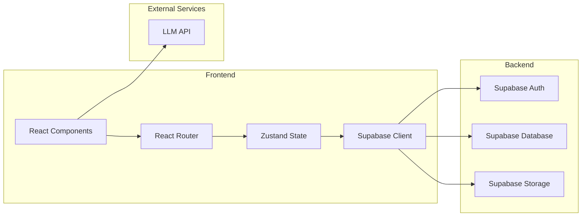
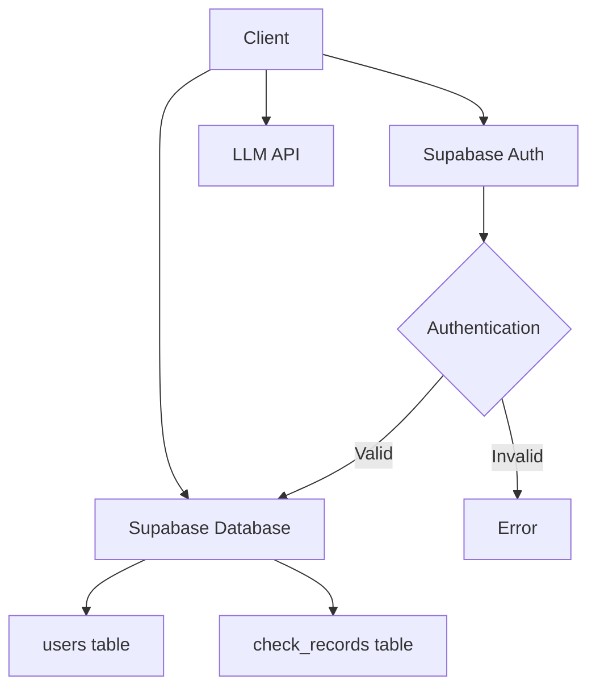
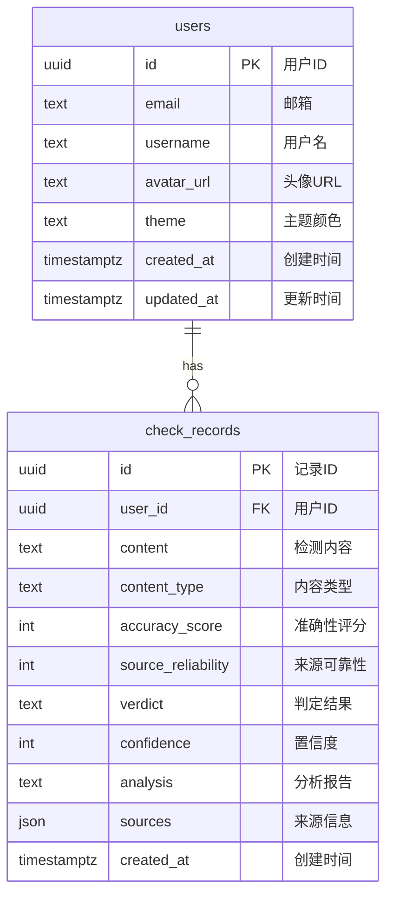

## 1. Architecture Design


## 2. Technology Description
- **Frontend**: React@18 + TypeScript + Tailwind CSS@3 + Vite
- **Initialization Tool**: vite-init (react-ts template)
- **State Management**: Zustand
- **Routing**: React Router DOM
- **Authentication & Database**: Supabase
- **Icons**: Lucide React
- **External API**: LLM API for content analysis

## 3. Route Definitions
| Route | Purpose |
|-------|---------|
| / | 首页，检测入口 |
| /result/:id | 检测结果详情页 |
| /profile | 个人中心 |
| /login | 登录页面 |
| /register | 注册页面 |
| /settings | 设置页面（密码修改、主题设置） |

## 4. API Definitions

### 4.1 检测API（前端直连LLM）
```typescript
interface CheckRequest {
  content: string;
  type: 'text' | 'url';
}

interface CheckResult {
  id: string;
  content: string;
  type: 'text' | 'url';
  accuracyScore: number;
  sourceReliability: number;
  verdict: 'true' | 'false' | 'unknown';
  confidence: number;
  analysis: string;
  sources: SourceInfo[];
  createdAt: Date;
}

interface SourceInfo {
  url: string;
  reliability: number;
  description: string;
}
```

### 4.2 用户API（Supabase Auth）
- 注册：`supabase.auth.signUp()`
- 登录：`supabase.auth.signInWithPassword()`
- 登出：`supabase.auth.signOut()`
- 修改密码：`supabase.auth.updateUser()`

## 5. Server Architecture Diagram


## 6. Data Model

### 6.1 Data Model Definition


### 6.2 Data Definition Language

```sql
CREATE TABLE users (
  id UUID PRIMARY KEY DEFAULT uuid_generate_v4(),
  email TEXT UNIQUE NOT NULL,
  username TEXT,
  avatar_url TEXT,
  theme TEXT DEFAULT 'blue',
  created_at TIMESTAMPTZ DEFAULT NOW(),
  updated_at TIMESTAMPTZ DEFAULT NOW()
);

CREATE TABLE check_records (
  id UUID PRIMARY KEY DEFAULT uuid_generate_v4(),
  user_id UUID REFERENCES users(id),
  content TEXT NOT NULL,
  content_type TEXT NOT NULL,
  accuracy_score INTEGER,
  source_reliability INTEGER,
  verdict TEXT,
  confidence INTEGER,
  analysis TEXT,
  sources JSONB,
  created_at TIMESTAMPTZ DEFAULT NOW()
);

CREATE INDEX idx_check_records_user_id ON check_records(user_id);
CREATE INDEX idx_check_records_created_at ON check_records(created_at);

GRANT SELECT ON users TO anon;
GRANT ALL PRIVILEGES ON users TO authenticated;
GRANT SELECT ON check_records TO anon;
GRANT ALL PRIVILEGES ON check_records TO authenticated;
```

## 7. Project Structure

```
src/
├── components/
│   ├── Header.tsx
│   ├── SearchInput.tsx
│   ├── CheckButton.tsx
│   ├── ResultCard.tsx
│   ├── HistoryList.tsx
│   ├── ThemeSelector.tsx
│   └── LoadingSpinner.tsx
├── pages/
│   ├── Home.tsx
│   ├── Result.tsx
│   ├── Profile.tsx
│   ├── Login.tsx
│   ├── Register.tsx
│   └── Settings.tsx
├── hooks/
│   ├── useAuth.ts
│   ├── useCheck.ts
│   └── useTheme.ts
├── store/
│   └── useStore.ts
├── utils/
│   ├── supabase.ts
│   └── api.ts
├── types/
│   └── index.ts
├── App.tsx
├── main.tsx
└── index.css
```